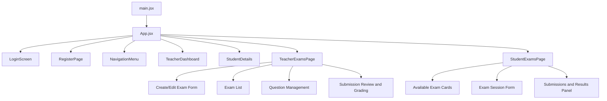
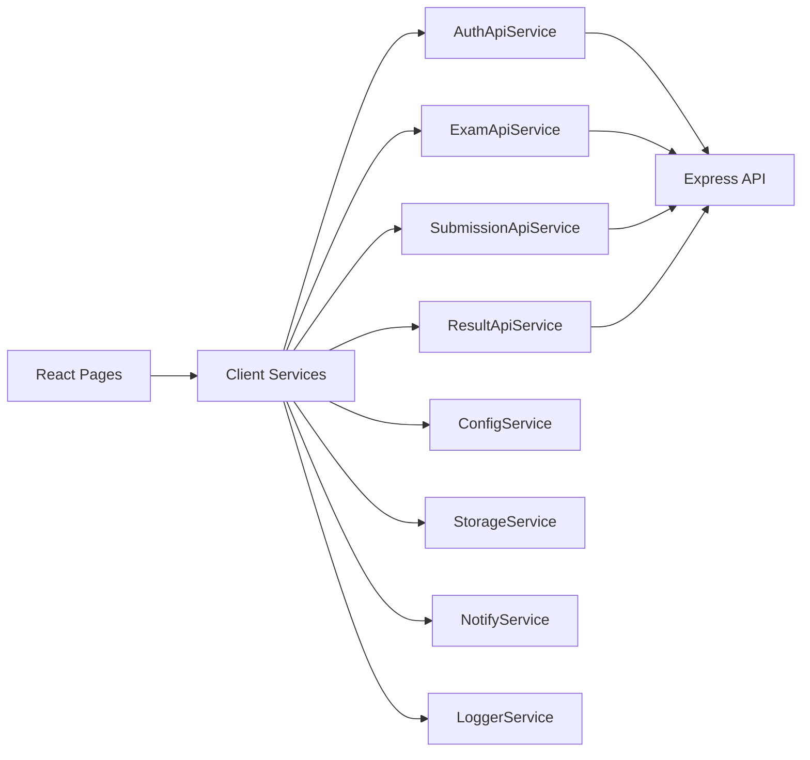

# Client Architecture

## Overview

The client is a React application built with Vite. It provides the user interface for login, role-based navigation, teacher exam management, student exam submission, and result viewing.

The client is located in:

```text
client/
```

## Main Client Responsibilities

- Render the login/register and role-based screens.
- Store the logged-in user state and token through client services.
- Show different navigation options for teacher and student users, while keeping internal admin users on admin-safe pages.
- Send API requests to the Express backend.
- Display loading, success, and error states.
- Keep UI behavior polished and predictable.

## Component and Page Hierarchy



## Main Client Files

| File or Folder | Purpose |
| --- | --- |
| `client/src/App.jsx` | Main application state and screen switching |
| `client/src/main.jsx` | React entry point |
| `client/src/components/` | Shared UI components and dashboards |
| `client/src/components/layout/NavigationMenu.jsx` | Navigation menu |
| `client/src/pages/auth/RegisterPage.jsx` | Registration page |
| `client/src/pages/teacher/TeacherExamsPage.jsx` | Teacher exam, question, submission, and grading workflow |
| `client/src/pages/student/StudentExamsPage.jsx` | Student exam, submission, and result workflow |
| `client/src/services/` | API and utility services |
| `client/src/models/` | Client-side model classes or data shapes |
| `client/src/utils/roleAccess.js` | Role access helpers |

## Client Service Layer

The service layer keeps API communication out of the UI components.



## Teacher UI Workflow

The teacher page supports:

- Loading exams from the backend.
- Creating new exams.
- Editing exam details.
- Updating exam status, including publishing.
- Opening question management for an exam.
- Adding questions and options.
- Viewing submissions for an exam.
- Reviewing and grading submissions.
- Publishing results.

## Student UI Workflow

The student page supports:

- Loading available exams.
- Opening an exam session.
- Loading exam questions.
- Starting a submission.
- Answering multiple choice or text questions.
- Submitting answers.
- Viewing submissions and available results.
- Opening result details and feedback.

## Client Quality Checks

Recommended checks before submission:

```bash
cd client
npm run lint
npm run build
```

The lint command checks code quality rules, including React hook rules. The build command verifies that the production frontend can be generated successfully.
