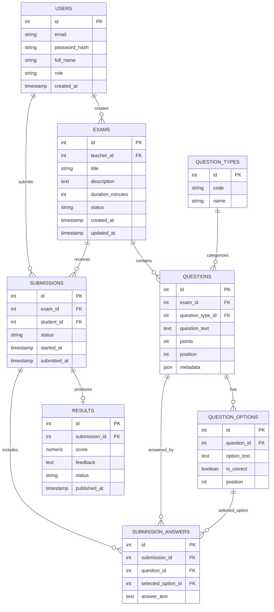

# Database ERD and JSON Models

## Overview

The database is PostgreSQL. It stores users, roles, exams, questions, options, submissions, answers, and results. The backend owns all database access.

## Entity Relationship Diagram



## Data Model Notes

- A teacher user can create many exams.
- An exam can contain many questions.
- A question belongs to a question type.
- Multiple choice questions can have multiple answer options.
- A student can create submissions for exams.
- A submission contains the student's answers.
- A result belongs to a submission and stores the grade and feedback.
- Exam status controls availability and lifecycle, for example draft, published, closed, or archived.

## Example JSON Models

### User

```json
{
  "id": 1,
  "email": "dana.teacher@examapp.test",
  "fullName": "Dana Teacher",
  "role": "teacher"
}
```

### Exam

```json
{
  "id": 10,
  "title": "JavaScript Basics",
  "description": "Short exam about JavaScript fundamentals",
  "durationMinutes": 60,
  "status": "published"
}
```

### Question

```json
{
  "id": 101,
  "examId": 10,
  "questionTypeId": 1,
  "questionText": "Which keyword declares a constant in JavaScript?",
  "points": 10,
  "position": 1,
  "metadata": {},
  "options": [
    {
      "id": 1001,
      "optionText": "const",
      "isCorrect": true,
      "position": 1
    },
    {
      "id": 1002,
      "optionText": "var",
      "isCorrect": false,
      "position": 2
    }
  ]
}
```

### Submission

```json
{
  "id": 200,
  "examId": 10,
  "studentId": 2,
  "status": "submitted",
  "startedAt": "2026-07-09T10:00:00.000Z",
  "submittedAt": "2026-07-09T10:20:00.000Z"
}
```

### Submission Answer

```json
{
  "id": 300,
  "submissionId": 200,
  "questionId": 101,
  "selectedOptionId": 1001,
  "answerText": null
}
```

### Result

```json
{
  "id": 400,
  "submissionId": 200,
  "score": 95,
  "feedback": "Strong work. Review one syntax detail.",
  "status": "published"
}
```
