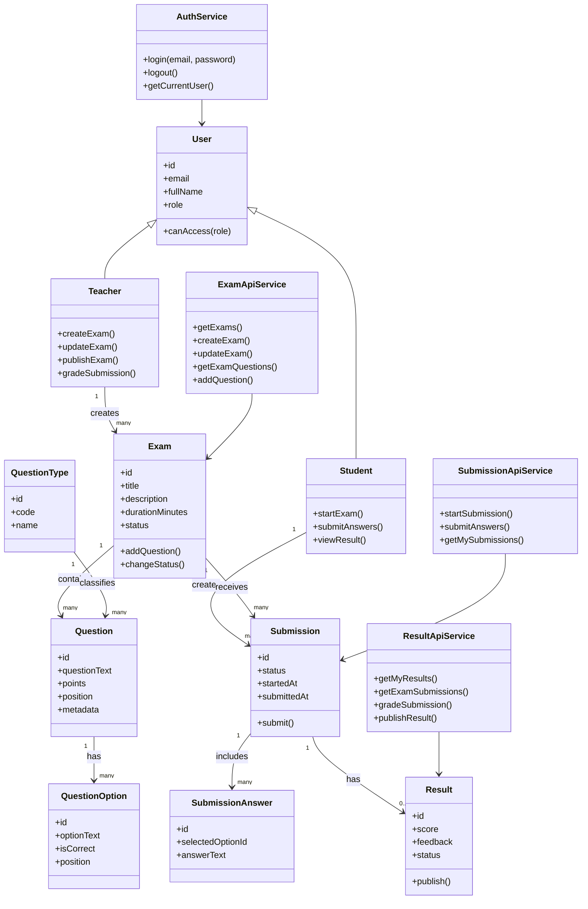

# OOP UML / Class Diagram

## Overview

The project uses clear model concepts across the client, server, and database. The following UML diagram represents the main domain objects and their relationships.

## Class Responsibilities

| Class / Concept | Responsibility |
| --- | --- |
| User | Shared identity data for all users |
| Teacher | Teacher-specific exam and grading actions |
| Student | Student-specific exam-taking actions |
| Exam | Exam metadata and lifecycle status |
| Question | Question content and scoring value |
| QuestionType | Type/category for questions |
| QuestionOption | Possible answer for multiple choice questions |
| Submission | Student attempt for an exam |
| SubmissionAnswer | One answer inside a submission |
| Result | Score, feedback, and publication status |
| AuthService | Login/logout and user session behavior |
| ExamApiService | Client API access for exams and questions |
| SubmissionApiService | Client API access for submissions |
| ResultApiService | Client API access for grading and results |

## OOP Principles Demonstrated

- Encapsulation: API and storage details are kept inside service classes/modules.
- Separation of concerns: UI components, services, routes, controllers, and database logic have separate responsibilities.
- Reuse: Shared user and domain model concepts are used across workflows.
- Abstraction: React components call service methods instead of building HTTP requests directly in every UI interaction.
