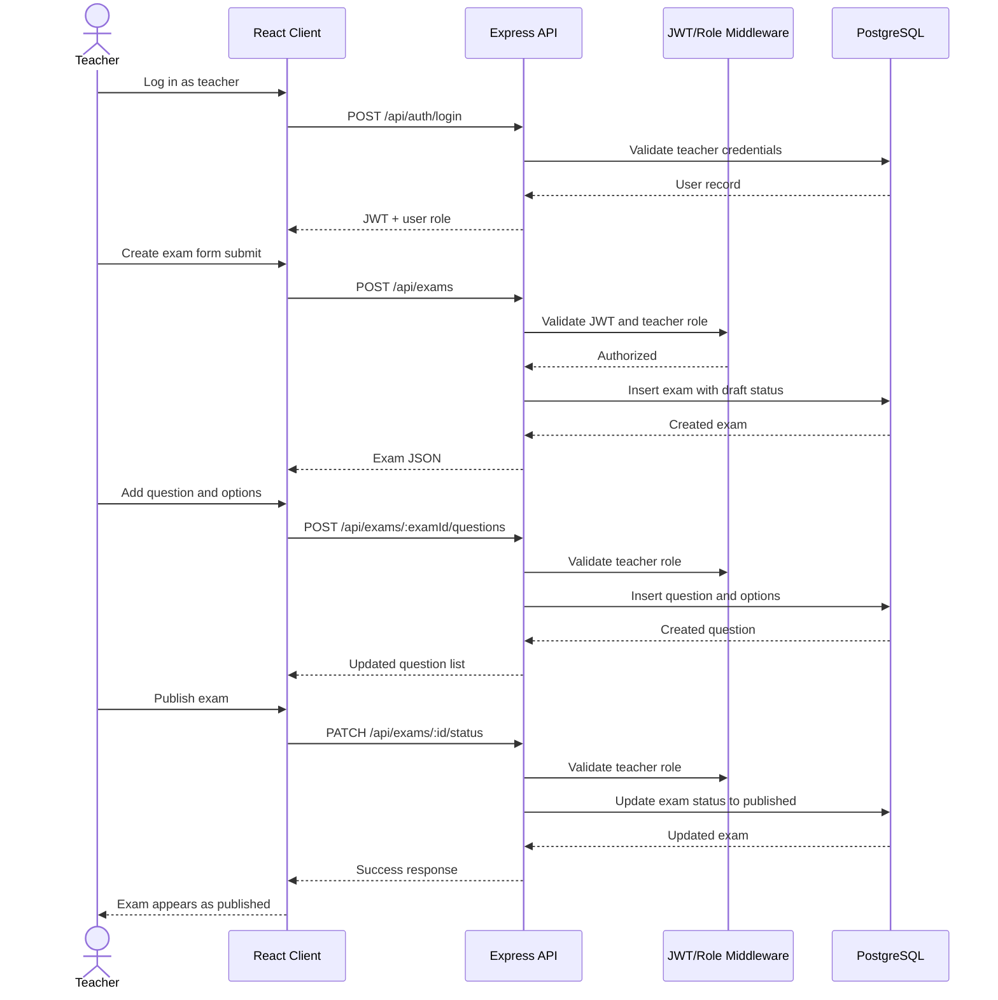
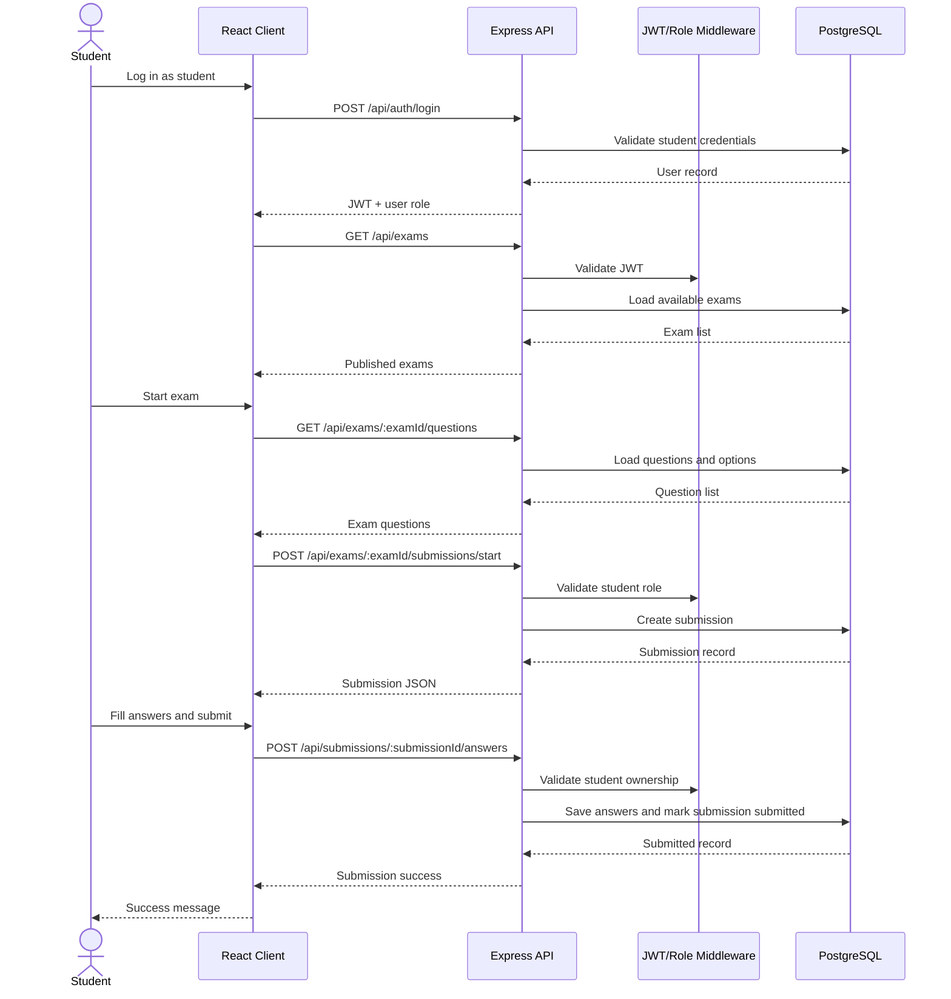
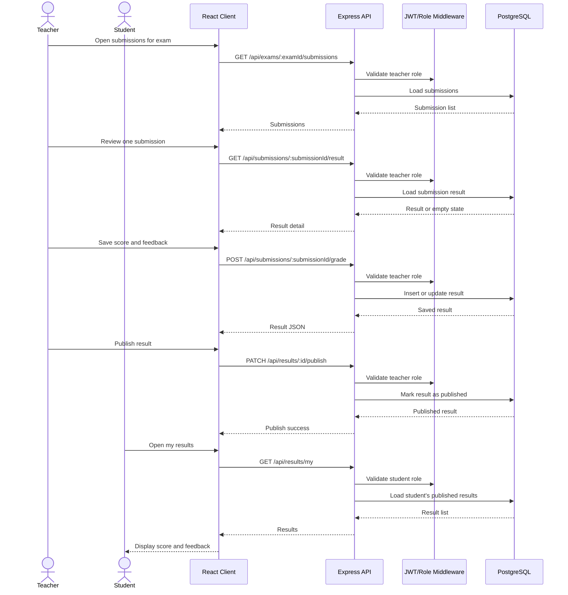

# Sequence Diagrams

## Scenario 1: Teacher Creates and Publishes an Exam

```mermaid
sequenceDiagram
    actor Teacher
    participant Client as React Client
    participant API as Express API
    participant Auth as JWT/Role Middleware
    participant DB as PostgreSQL

    Teacher->>Client: Log in as teacher
    Client->>API: POST /api/auth/login
    API->>DB: Validate teacher credentials
    DB-->>API: User record
    API-->>Client: JWT + user role

    Teacher->>Client: Create exam form submit
    Client->>API: POST /api/exams
    API->>Auth: Validate JWT and teacher role
    Auth-->>API: Authorized
    API->>DB: Insert exam with draft status
    DB-->>API: Created exam
    API-->>Client: Exam JSON

    Teacher->>Client: Add question and options
    Client->>API: POST /api/exams/:examId/questions
    API->>Auth: Validate teacher role
    API->>DB: Insert question and options
    DB-->>API: Created question
    API-->>Client: Updated question list

    Teacher->>Client: Publish exam
    Client->>API: PATCH /api/exams/:id/status
    API->>Auth: Validate teacher role
    API->>DB: Update exam status to published
    DB-->>API: Updated exam
    API-->>Client: Success response
    Client-->>Teacher: Exam appears as published
```

## Scenario 2: Student Starts Exam and Submits Answers

```mermaid
sequenceDiagram
    actor Student
    participant Client as React Client
    participant API as Express API
    participant Auth as JWT/Role Middleware
    participant DB as PostgreSQL

    Student->>Client: Log in as student
    Client->>API: POST /api/auth/login
    API->>DB: Validate student credentials
    DB-->>API: User record
    API-->>Client: JWT + user role

    Client->>API: GET /api/exams
    API->>Auth: Validate JWT
    API->>DB: Load available exams
    DB-->>API: Exam list
    API-->>Client: Published exams

    Student->>Client: Start exam
    Client->>API: GET /api/exams/:examId/questions
    API->>DB: Load questions and options
    DB-->>API: Question list
    API-->>Client: Exam questions

    Client->>API: POST /api/exams/:examId/submissions/start
    API->>Auth: Validate student role
    API->>DB: Create submission
    DB-->>API: Submission record
    API-->>Client: Submission JSON

    Student->>Client: Fill answers and submit
    Client->>API: POST /api/submissions/:submissionId/answers
    API->>Auth: Validate student ownership
    API->>DB: Save answers and mark submission submitted
    DB-->>API: Submitted record
    API-->>Client: Submission success
    Client-->>Student: Success message
```

## Scenario 3: Teacher Grades Result and Student Views Result

```mermaid
sequenceDiagram
    actor Teacher
    actor Student
    participant Client as React Client
    participant API as Express API
    participant Auth as JWT/Role Middleware
    participant DB as PostgreSQL

    Teacher->>Client: Open submissions for exam
    Client->>API: GET /api/exams/:examId/submissions
    API->>Auth: Validate teacher role
    API->>DB: Load submissions
    DB-->>API: Submission list
    API-->>Client: Submissions

    Teacher->>Client: Review one submission
    Client->>API: GET /api/submissions/:submissionId/result
    API->>Auth: Validate teacher role
    API->>DB: Load submission result
    DB-->>API: Result or empty state
    API-->>Client: Result detail

    Teacher->>Client: Save score and feedback
    Client->>API: POST /api/submissions/:submissionId/grade
    API->>Auth: Validate teacher role
    API->>DB: Insert or update result
    DB-->>API: Saved result
    API-->>Client: Result JSON

    Teacher->>Client: Publish result
    Client->>API: PATCH /api/results/:id/publish
    API->>Auth: Validate teacher role
    API->>DB: Mark result as published
    DB-->>API: Published result
    API-->>Client: Publish success

    Student->>Client: Open my results
    Client->>API: GET /api/results/my
    API->>Auth: Validate student role
    API->>DB: Load student's published results
    DB-->>API: Result list
    API-->>Client: Results
    Client-->>Student: Display score and feedback
```
