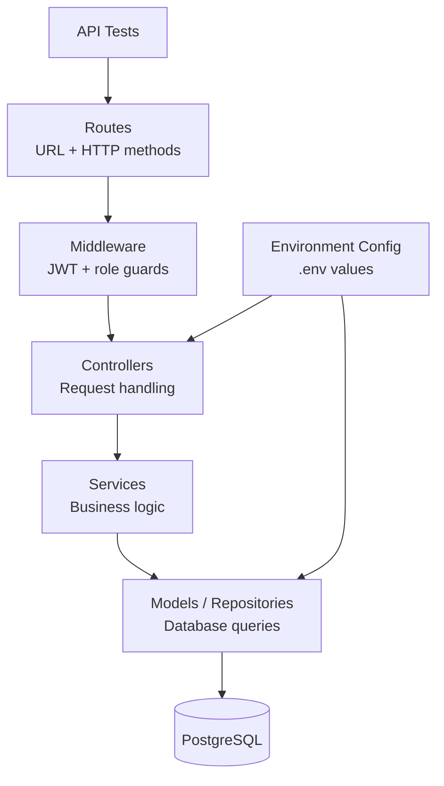

# Server Architecture

## Overview

The backend is a Node.js and Express API located in:

```text
server/
```

It is responsible for authentication, authorization, business rules, API responses, and database access. The frontend never talks directly to PostgreSQL.

## Backend Responsibilities

- Provide REST API endpoints.
- Authenticate users with JWT.
- Protect private routes with authentication middleware.
- Apply role-based access for teacher and student workflows, with admin-safe backend coverage where needed.
- Validate API input before database operations.
- Store and retrieve data from PostgreSQL.
- Return JSON responses to the React client.
- Support backend API tests.

## MVC / Package Structure

The exact file names may vary by implementation, but the backend follows the common Express separation of responsibilities:



## Main API Areas

| API Area | Purpose |
| --- | --- |
| Health | Check that the backend is running |
| Auth | Login, register where enabled, current user handling |
| Exams | Create, list, update, publish, and manage exams |
| Questions | Load question types and manage exam questions/options |
| Submissions | Start an exam submission and submit answers |
| Results | Grade submissions, publish results, view result details |

## Authentication and Authorization

The authentication flow is based on JWT:

1. User submits email and password.
2. Server validates credentials.
3. Server returns a signed JWT.
4. Client sends the token with protected requests.
5. Server middleware validates the token.
6. Role middleware checks whether the user can perform the requested action.

Example role separation:

| Role | Protected Backend Actions |
| --- | --- |
| Teacher | Create/update exams, add questions, review submissions, grade and publish results |
| Student | Start submissions, submit answers, view own submissions/results |

An internal admin role exists in the seed data for backend coverage, but it is not presented as a main UI workflow.

## Error Handling

The server should return clear HTTP statuses and JSON error messages. Common examples:

| Status | Meaning |
| --- | --- |
| `200` | Request succeeded |
| `201` | Resource created |
| `400` | Invalid request body or missing data |
| `401` | Missing or invalid authentication |
| `403` | User is authenticated but not allowed |
| `404` | Requested resource was not found |
| `500` | Unexpected server error |

## Environment Configuration

The backend uses environment variables for values such as:

- Server port
- Database connection details
- JWT secret
- Runtime environment

The active local environment file is kept under `server/`. Do not commit private secrets to a public repository.

## Backend Testing

Backend tests are part of the project and should be run before final submission:

```bash
cd server
npm test
```

The tests are expected to verify important API behavior, such as health checks, authentication, protected routes, and exam-related flows covered by the implemented test suite.
