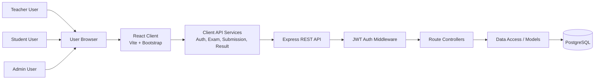
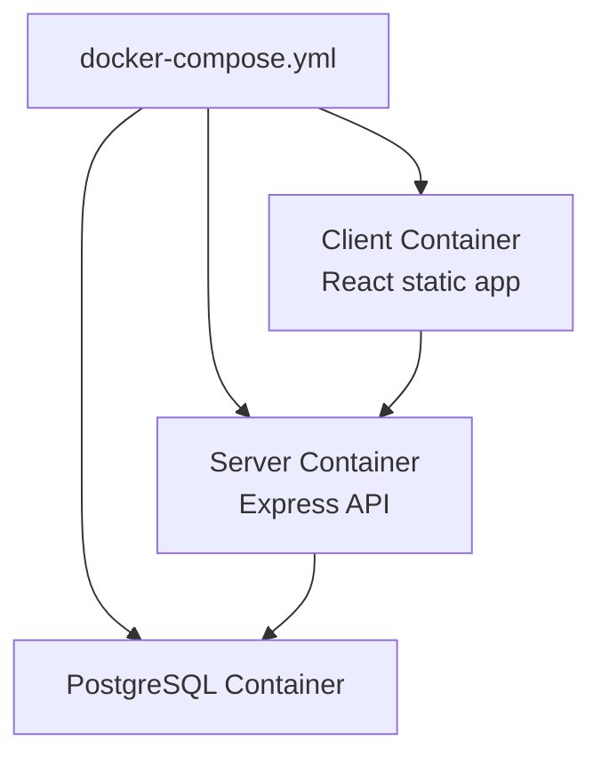

# System Architecture

## High-Level Architecture

The application is split into three main parts:

- `client/`: React frontend used by students, teachers, and admins.
- `server/`: Express backend that exposes the REST API and applies authentication and authorization.
- `db/`: PostgreSQL database scripts and schema-related files.

The client communicates with the server through HTTP API calls. The server validates JWT tokens, checks user roles where required, and reads/writes data in PostgreSQL.



## Request Data Flow

1. A user logs in through the React frontend.
2. The frontend sends credentials to the backend authentication API.
3. The backend validates the user and returns a JWT.
4. The frontend stores the authentication state and sends the token with protected API requests.
5. The backend middleware validates the token and checks the user's role.
6. Controllers process the request and use the database layer.
7. PostgreSQL stores users, exams, questions, submissions, answers, and results.
8. The API returns JSON responses to the client.
9. React updates the UI based on the response.

## Main Modules

| Module | Responsibility |
| --- | --- |
| React Pages | Render teacher, student, auth, and dashboard screens |
| React Services | Centralize API calls and data exchange with the backend |
| Express Routes | Define REST endpoints |
| Auth Middleware | Validate JWT tokens and protect private routes |
| Role Guards | Restrict teacher/student/admin actions |
| Controllers | Implement request handling logic |
| Models / Data Access | Query PostgreSQL and map rows to API responses |
| PostgreSQL | Store relational project data |

## Role-Based Access

The application uses roles to separate workflows:

| Role | Example Access |
| --- | --- |
| Teacher | Manage exams, questions, submissions, and grading |
| Student | View available exams, submit answers, view results |
| Admin | Access administrative role paths where implemented |

Role checks should be enforced on the backend for protected operations. The frontend also uses role-based navigation so users see the screens that match their role.

## Docker Architecture

Docker Compose is used to run the project services together:



Expected URLs:

```text
Frontend: http://localhost:3000/FullStack_React/
Backend health: http://localhost:5000/api/health
```

## Important Design Decisions

- The frontend and backend are separate applications.
- The frontend does not access the database directly.
- The backend owns authentication, authorization, and persistence.
- PostgreSQL is used for relational data such as exams, questions, submissions, and results.
- API services in the client keep HTTP logic out of React components.
- Docker Compose gives a repeatable way to start the system.
