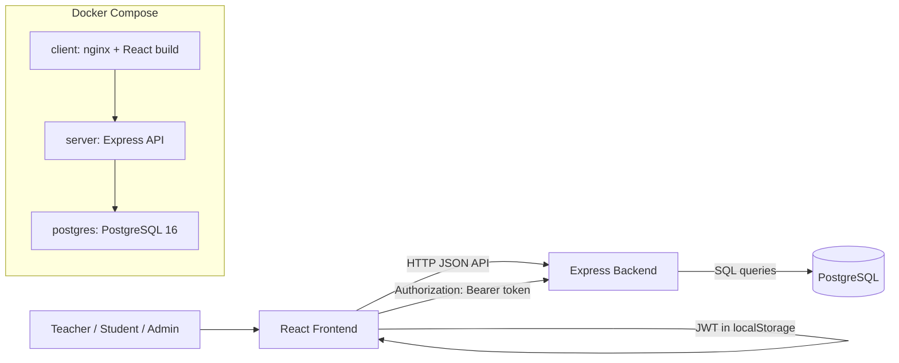
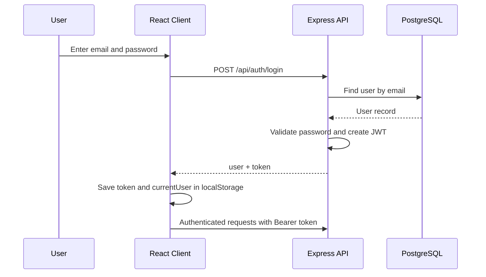
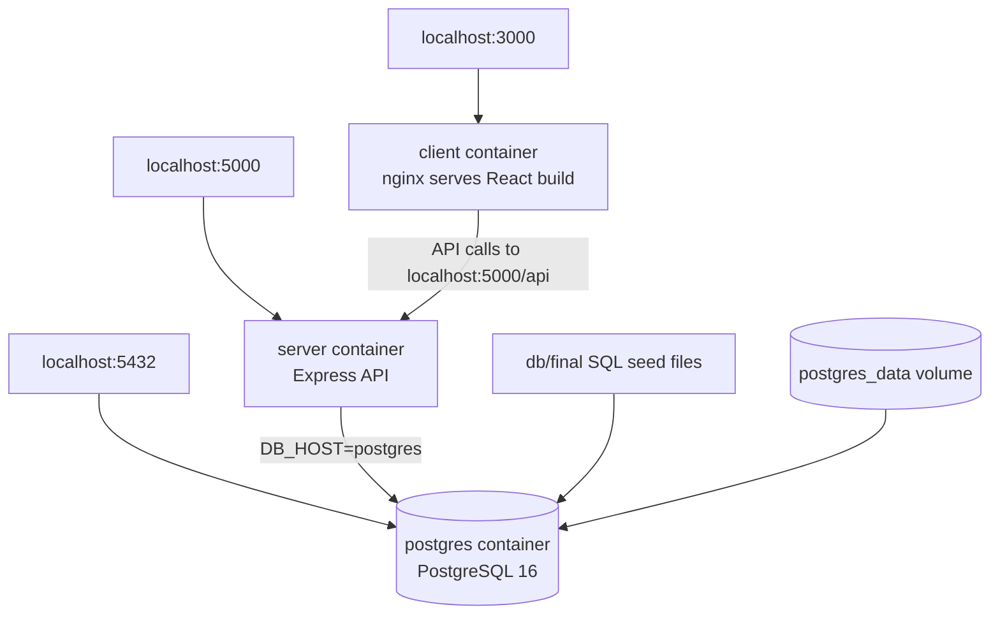

# System Architecture

## Project Goal

The Full Stack Exam Management System is a web application for managing online exams. It supports teacher exam creation, student exam submission, grading, result publishing, and role-based access using JWT authentication.

## Technologies Used

- Frontend: React, Vite, Bootstrap
- Backend: Node.js, Express
- Database: PostgreSQL
- Authentication: JWT
- Deployment/runtime: Docker Compose
- Static frontend serving: nginx

## High-Level Architecture

## Responsibilities

### Frontend

The React frontend is responsible for login/register screens, storing the JWT token, showing role-based pages, and sending authenticated API requests.

### Backend

The Express backend handles authentication, authorization, validation, exam APIs, submission APIs, result APIs, and database access.

### Database

PostgreSQL stores users, exams, questions, options, submissions, submitted answers, results, and feedback.

## Authentication Flow

## Roles

- Teacher: manage exams, questions, submissions, grades, and published results
- Student: view available exams, submit answers, and view published results
- Admin: seeded for administrative access and future extension

## Docker Architecture

## URLs

- Frontend: `http://localhost:3000/FullStack_React/`
- Backend API: `http://localhost:5000/api`
- Health check: `http://localhost:5000/api/health`
