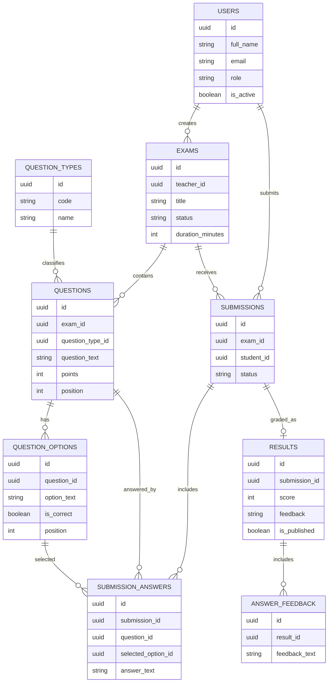

# Database Design

## Overview

The database is PostgreSQL. The final schema and seed data are stored in:

- `db/final/001_final_schema.sql`
- `db/final/002_final_seed.sql`

The database stores users, exams, questions, submissions, answers, results, and feedback. The design separates exam content from student submissions and teacher grading.

## Main Tables

### users

Stores application users.

Important fields:

- `id`
- `full_name`
- `email`
- `password_hash`
- `role`
- `is_active`

### exams

Stores exams created by teachers.

Important fields:

- `id`
- `teacher_id`
- `title`
- `description`
- `duration_minutes`
- `status`

Common statuses:

- `draft`
- `published`
- `closed`
- `archived`

### question_types

Stores supported question type definitions, such as multiple choice or text-style questions.

### questions

Stores questions that belong to an exam.

Important fields:

- `id`
- `exam_id`
- `question_type_id`
- `question_text`
- `points`
- `position`
- `metadata`

### question_options

Stores selectable answer options.

Important fields:

- `id`
- `question_id`
- `option_text`
- `is_correct`
- `position`

### submissions

Stores a student's attempt for an exam.

Important fields:

- `id`
- `exam_id`
- `student_id`
- `status`

### submission_answers

Stores submitted answers.

Important fields:

- `id`
- `submission_id`
- `question_id`
- `selected_option_id`
- `answer_text`

### results

Stores teacher grading and published result data.

Important fields:

- `id`
- `submission_id`
- `score`
- `feedback`
- `is_published`

### answer_feedback

Stores optional feedback for individual answers if returned by the backend.

## ERD-Style Diagram

## Seed Users

| Role | Email | Password |
| --- | --- | --- |
| Teacher | `dana.teacher@examapp.test` | `123456` |
| Student | `alice.student@examapp.test` | `123456` |
| Admin | `admin@examapp.test` | `123456` |
