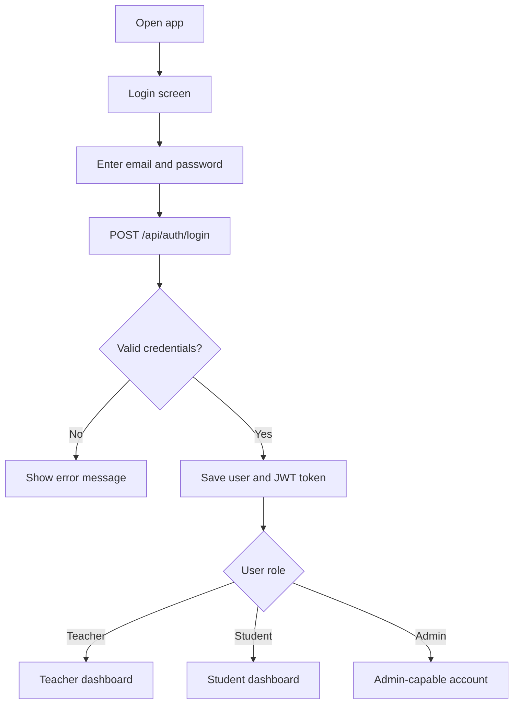
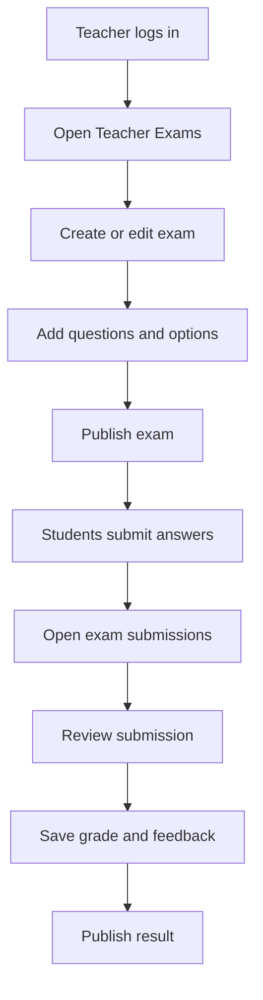
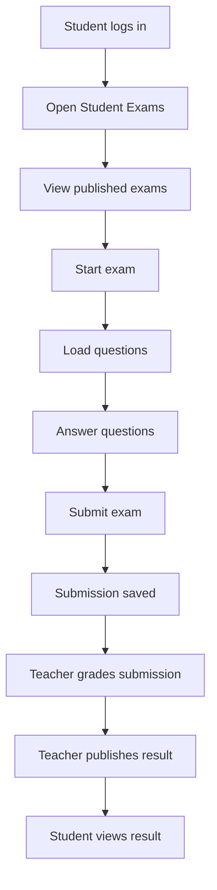
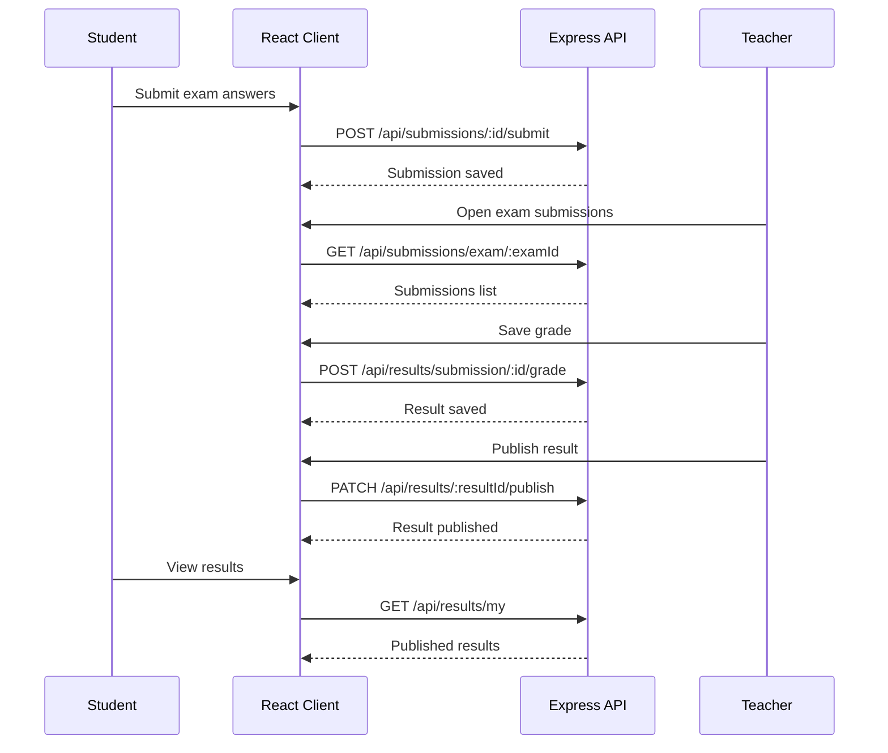

# User Flows

## Authentication Flow

## Teacher Workflow

## Teacher Features

Teachers can:

- Create and edit exams
- Change exam status
- Add questions and options
- View submissions for an exam
- Review student submissions
- Save score and feedback
- Publish results

## Student Workflow

## Student Features

Students can:

- View available exams
- Start an exam submission
- Answer multiple choice or text questions
- Submit answers
- View submission history
- View published results and feedback

## Result Publishing Flow

