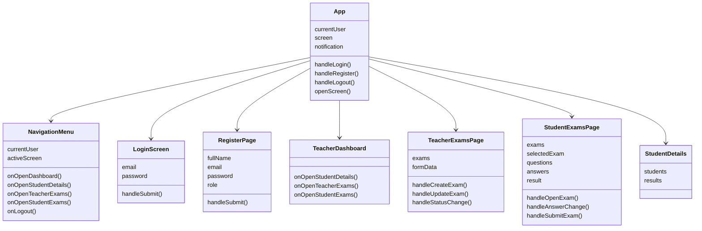
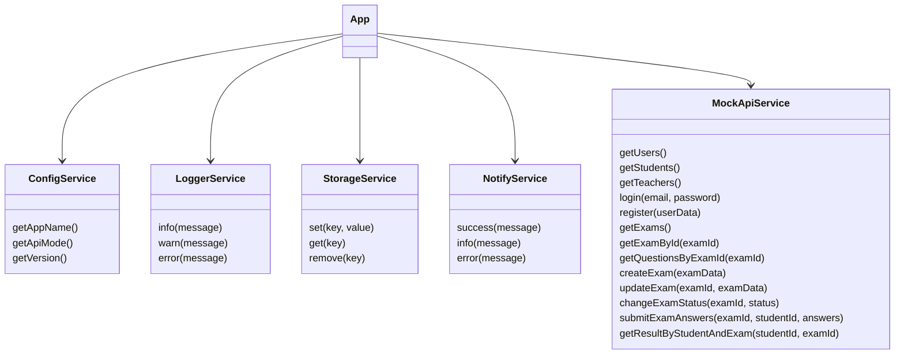
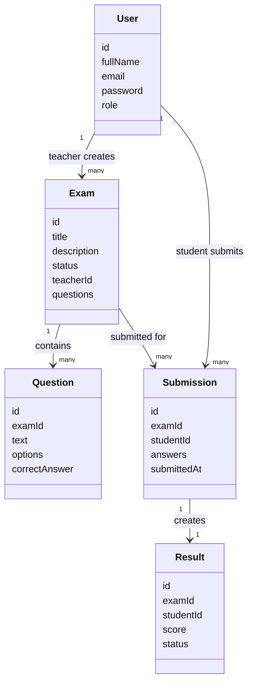
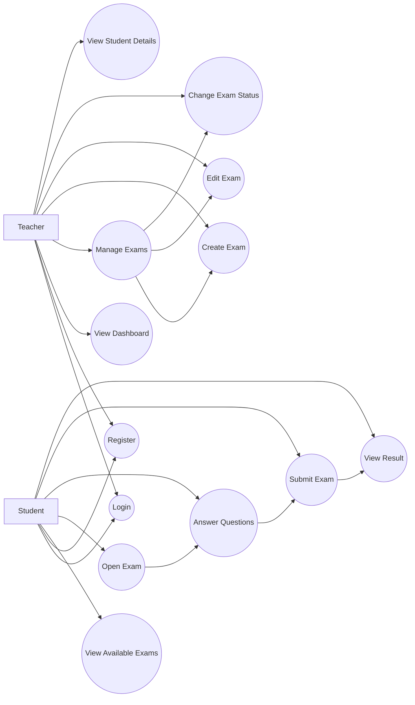

# Project 2 Documentation - React Exams App

## Project Overview

This project is a React exams application that works without a real backend server.

The app uses mock data and mock API services to simulate a full exam system.  
It includes authentication, teacher pages, student pages, exam management, student exam submission, results, and shared services.

---

## Components Hierarchy

```text
App
├── LoginScreen
├── RegisterPage
├── NavigationMenu
├── TeacherDashboard
├── StudentDetails
├── TeacherExamsPage
│   ├── Create Exam Form
│   └── Exams List
└── StudentExamsPage
    ├── Available Exams List
    ├── Exam Questions View
    └── Result View
```

### Main Client Areas

```text
client/src
├── components
│   ├── layout
│   │   └── NavigationMenu.jsx
│   ├── shared
│   ├── LoginScreen.jsx
│   ├── TeacherDashboard.jsx
│   └── StudentDetails.jsx
├── pages
│   ├── auth
│   │   └── RegisterPage.jsx
│   ├── teacher
│   │   └── TeacherExamsPage.jsx
│   └── student
│       └── StudentExamsPage.jsx
├── services
│   ├── ConfigService.js
│   ├── LoggerService.js
│   ├── StorageService.js
│   ├── NotifyService.js
│   ├── MockApiService.js
│   └── index.js
├── models
│   ├── User.js
│   ├── Exam.js
│   ├── Question.js
│   ├── Submission.js
│   └── Result.js
└── data
    └── mockDatabase.js
```

---

## UML Structure



---

## Services Structure



---

## Main Mock Database Entities



---

## Main Entities Used by DB Mocking

The mock database includes these main entities:

### User

Represents a system user.

Used for:

- Login
- Register
- Teacher role
- Student role

Main fields:

```text
id
fullName
email
password
role
```

### Exam

Represents an exam created by a teacher.

Used for:

- Viewing exams
- Creating exams
- Editing exams
- Changing exam status
- Showing active exams to students

Main fields:

```text
id
title
description
status
teacherId
questions
```

### Question

Represents a question inside an exam.

Used for:

- Showing exam questions to students
- Checking submitted answers

Main fields:

```text
id
examId
text
options
correctAnswer
```

### Submission

Represents the answers submitted by a student.

Used for:

- Saving student answers
- Connecting a student to an exam attempt

Main fields:

```text
id
examId
studentId
answers
submittedAt
```

### Result

Represents the final result after submitting an exam.

Used for:

- Showing score
- Showing pass/fail status

Main fields:

```text
id
examId
studentId
score
status
```

---

## Use Case Diagram



---

## Application Flow

### Authentication Flow

```text
User opens app
User logs in or registers
MockApiService checks or creates user
StorageService saves current user
App opens dashboard
NavigationMenu allows moving between screens
```

### Teacher Flow

```text
Teacher logs in
Teacher opens dashboard
Teacher opens Manage Exams
Teacher creates a new exam
Teacher can edit exam details
Teacher can change exam status
```

### Student Flow

```text
Student logs in
Student opens Student Exams
Student opens an active exam
Student answers questions
Student submits the exam
MockApiService calculates score
Student sees result
```

---

## Mock API Usage

The application does not use a real server.

Instead, it uses:

```text
mockDatabase.js
MockApiService.js
```

The `MockApiService` simulates backend actions such as:

- login
- register
- get users
- get exams
- create exam
- update exam
- submit exam answers
- calculate result

---

## Services Used

### ConfigService

Used to get app configuration values, such as app name and API mode.

### LoggerService

Used to log app actions, such as login, navigation, and data loading.

### StorageService

Used to save and read data from browser local storage.

### NotifyService

Used to create notification messages for successful login and registration.

### MockApiService

Used as the fake backend layer for all mock database operations.